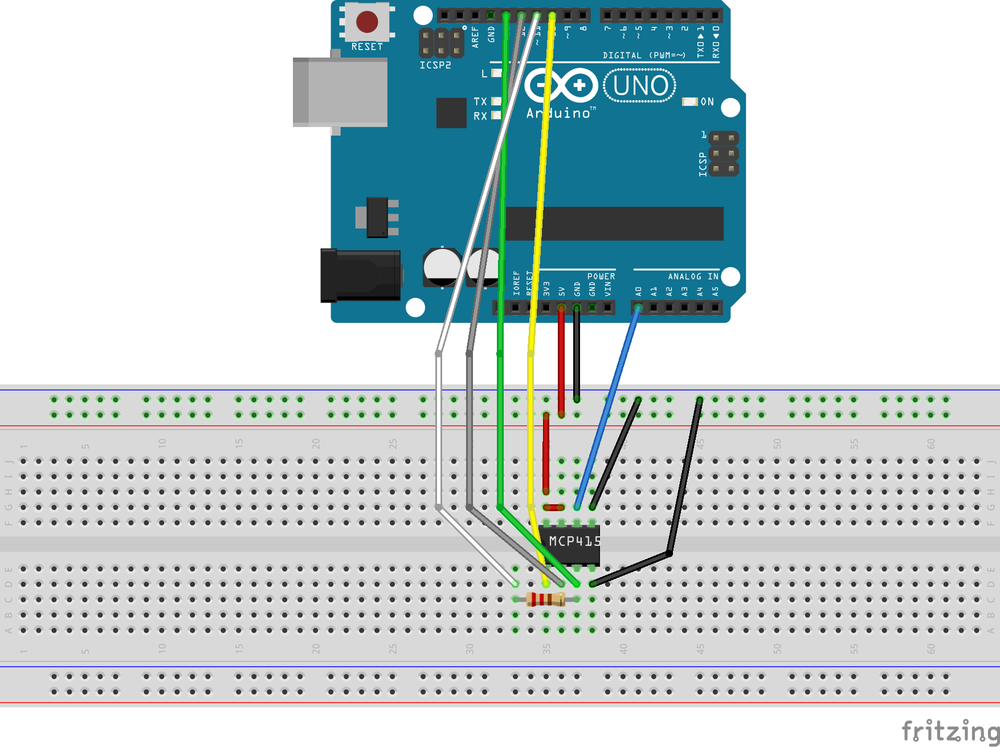

# MCP4151 & Arduino

I tested the MCP4151 (-103 & -104) Poti with Arduino and collected some data.

## Voltage Measurement

The file /src/pot_u.cpp is used to measure the voltage of the potis voltage divider. 

#### Wiring Diagram:

## Resistance Measurement

The file /src/pot_r.cpp is used to measure the resistance when the poti is in rheostat mode.

#### Wiring Diagram:

Coming soon...

## Usage

Uncomment the file you want to upload with .cpp
The .off files won't be uploaded!

## Results

The resulting data can be found under /results.
For the plotted data see [this repository](https://github.com/PaulusElektrus/MA-Plots/tree/main/MCP4151)

## Goal of the Project

I controlled a power supply (SMPS) with the MCP4151 instead of a trim potentiometer.
See the code under /src/pot_smps.cpp
It works, but the pots lowest value is ~200 Ohm and to much to reach the voltage I wanted.
Therefore I will try to inject current with the PWM output of the Arduino. --> Repository will follow...

## Credits 

Thanks to [Nathan Barnett](https://github.com/nwb99/MCP4151) for the MCP library. (located under /lib)